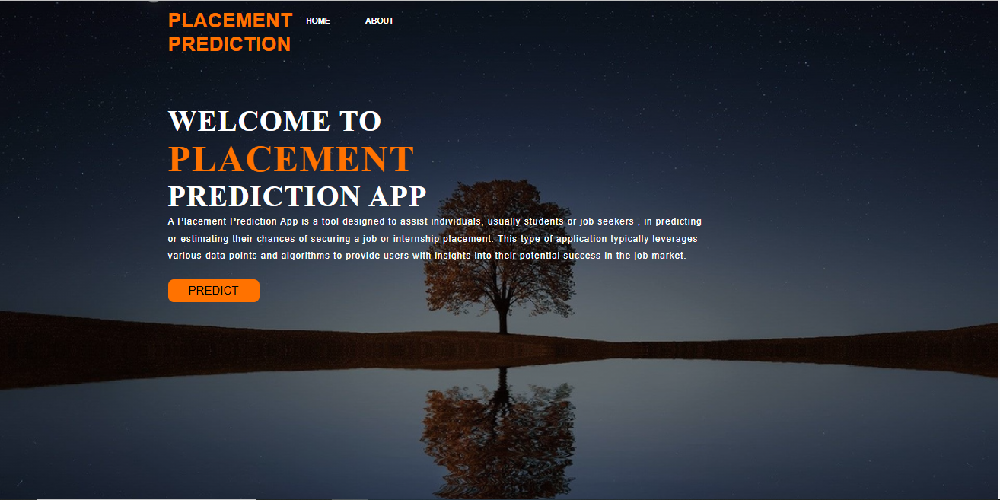
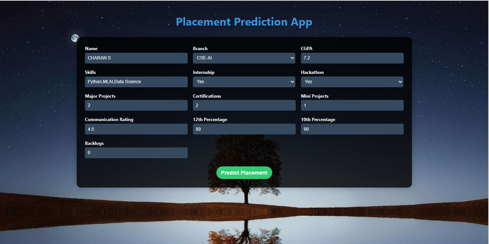
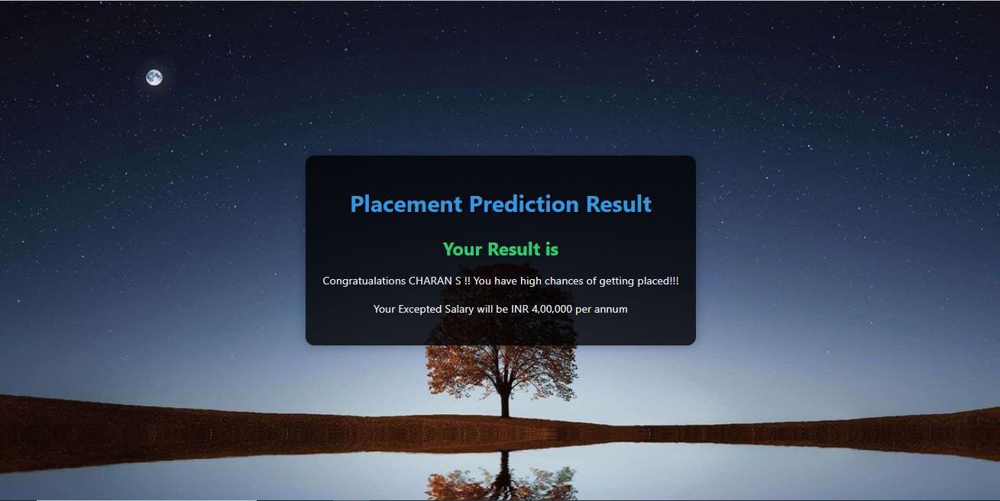

# Placement Prediction using Machine Learning

This project focuses on predicting student placement and salary in campus recruitment using Random Forest classifiers. The goal is to help students and educational institutions understand the factors that influence placement success and expected salary.

## Final Result

## Table of Contents
- [Overview](#overview)
- [Dataset](#dataset)
- [Installation](#installation)
- [Project Structure](#project-structure)
- [Data Preprocessing](#data-preprocessing)
- [Model Training](#model-training)
- [Evaluation](#evaluation)
- [Results](#results)
- [Contributing](#contributing)
- [License](#license)

## Overview

Campus placement is a crucial event for students and educational institutions. Predicting placement outcomes and potential salaries can help students prepare better and institutions improve their placement strategies. This project uses Random Forest classifiers to predict both placement probability and expected salary based on various student features.

## Dataset

The dataset used in this project includes student information such as:
- Academic performance (CGPA)
- Skills
- Weather the Candidate has done Intership
- Weather the Candidate has Participated in hackathons
- Other relevant features

The dataset contains features for predicting both placement status and salary.

## Installation

To run this project locally, follow these steps:

1. Clone the repository:
   git clone https://github.com/charans2702/Placement_Prediction_Using_Machine-Learning.git
   
2. Install the required packages:
   pip install -r requirements.txt

## Project Structure

- `static/`: Contains images and css files
- `templates/`: Contains HTML files
- `app.py`: Main Flask App
- `model.pkl`: Pickle file of predicting placement model
- `model1.pkl`: Pickle file of Salary Prediction model
- `Placement_prediction_data.csv`: Placement Prediction data
- `Placement_prediction.py`: Model for Placement Prediction
- `preprocessing.ipynb`: Jupyter Notebook for Data preprocessing
- `requirements.txt`: List of required Python packages
- `salary_prediction_data.csv`: Salary prediction data
- `salary_prediction.py`: Model for salary prediction
- `README.md`: Project documentation

## Data Preprocessing

The data preprocessing steps include:
1. Handling missing values
2. Encoding categorical variables
3. Feature scaling
4. Feature selection

## Model Training

Two Random Forest classifiers are trained:
1. Placement Prediction Model: Predicts whether a student will be placed
2. Salary Prediction Model: Predicts the salary for placed students

The training process involves:
1. Splitting the data into training and testing sets
2. Initializing the Random Forest classifiers
3. Training the models on the training set
4. Fine-tuning hyperparameters using techniques like Grid Search or Random Search

## Evaluation

The models' performance is evaluated using various metrics, including:
- Accuracy
- Precision
- Recall
- F1 Score
- Confusion Matrix
- Roc_Auc_Score

## Results

### Placement Prediction Model
- Accuracy: 88.7%
- Precision: 0.93
- Recall: 0.86
- F1 Score: 0.90
- Roc_Auc_Score:0.94

**CONFUSION MATRIX**:

**ROC CURVE**:

**FEATURE IMPORTANCE**:

## Flask App

The trained models are deployed using a Flask web application. The app allows users to input student details and receive predictions for placement probability and expected salary.

## Contributing

Contributions are welcome! Please feel free to submit a Pull Request or open an Issue.

## License

This project is licensed under the MIT License - see the LICENSE file for details.
